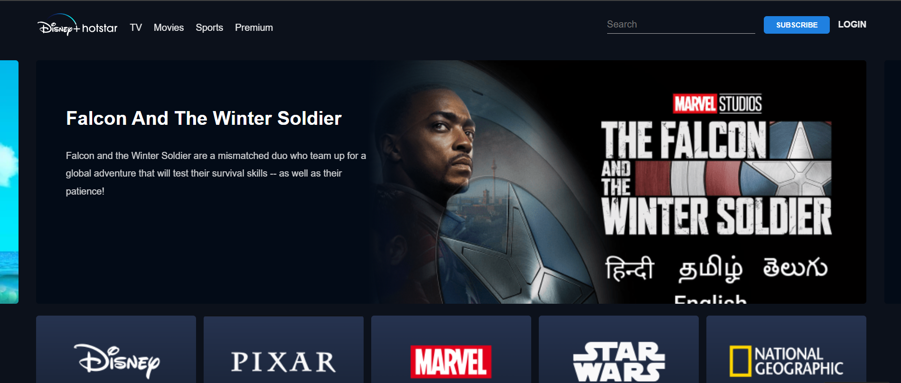

# 🔥 Hotstar Clone – HTML, CSS & JavaScript

A responsive Hotstar homepage clone built using HTML, CSS, and JavaScript. Includes interactive carousels, hover effects, and a clean UI. Designed to practice front-end development with a focus on layout, styling, and DOM manipulation using vanilla JS.

---

## 🔗 Live Demo

[Click here to view the project](https://github.com/Nishu002/HOTSTAR_CLONE)  
---

## 📸 Screenshots

  
*(Add screenshots in a `screenshots/` folder and update paths)*

---

## 🛠️ Technologies Used

- HTML5  
- CSS3  
- JavaScript (ES6)  

---

## ✨ Features

- Fully responsive layout  
- Navigation bar with logo & login  
- Hero banner with call-to-action  
- Scrollable carousels (JavaScript)  
- Hover effects & smooth transitions  

---

## 📚 What I Learned

- Structuring web pages with semantic HTML  
- Responsive design with CSS Grid & Flexbox  
- Media queries for different screen sizes  
- DOM manipulation and event handling in JavaScript  
- Building a real-world UI from scratch without frameworks  

---

## 💻 Run Locally

To run this project on your local machine:

```bash
git clone https://github.com/your-username/hotstar-clone.git
cd hotstar-clone
```

Then open `index.html` in your browser.

---

## 🔧 Future Improvements

- Add actual video playback or trailer popups  
- Create a working login/signup page  
- Integrate content using a public movie/show API  
- Add dark mode toggle  

---

## 🙏 Credits

Inspired by the UI of [Disney+ Hotstar](https://www.hotstar.com/). This project is built for learning and practice purposes only.

---

## 📄 License

This project is for educational use only. No copyright infringement intended.

Inspired by the UI of [Disney+ Hotstar](https://www.hotstar.com/). This project is built for learning and practice purposes only.

---
